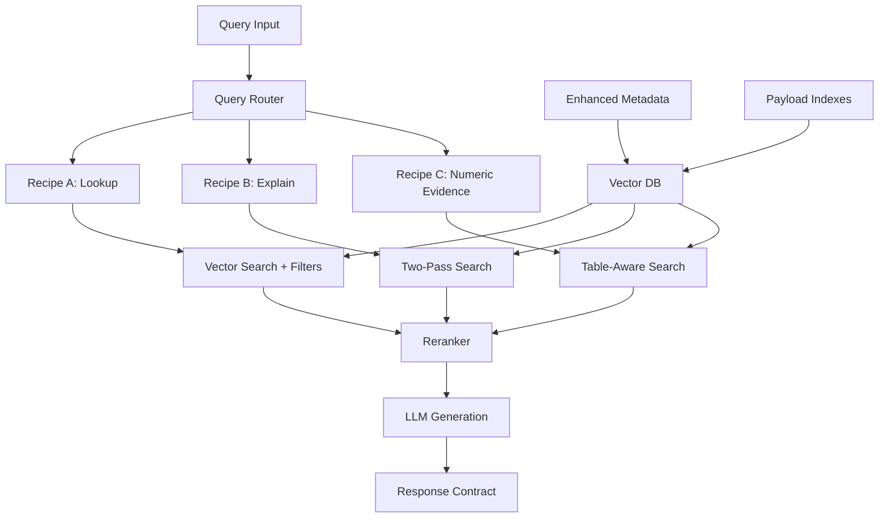

# Complete Proxy-GraphRAG Implementation Strategy

## Executive Summary

This document outlines a comprehensive strategy for implementing a **Graph-RAG-like workflow using Vector DB + rich metadata + smart retrieval**, avoiding the complexity of dedicated graph databases while achieving similar functionality through metadata-driven multi-pass vector search with intelligent filtering and routing.

**Core Philosophy**: Simulate graph traversal through metadata-driven multi-pass vector search with intelligent filtering and routing.

---

## 🎯 Architecture Overview



### Key Components
1. **Enhanced Metadata Layer** - Rich deterministic extraction
2. **Query Router** - Intent classification and recipe selection
3. **Three Retrieval Recipes** - Lookup, Explain, Numeric Evidence
4. **Response Contract** - Structured output with citations and provenance
5. **Production Infrastructure** - Caching, scaling, monitoring, security
6. **Monitoring & Feedback** - Quality assurance and continuous improvement

---

## 📋 Implementation Phases

### Phase 1: Foundation (Weeks 1-3)
**Goal**: Core lookup functionality with basic filtering

### Phase 2: Graph-Like Behavior (Weeks 4-7)
**Goal**: Two-pass retrieval and advanced routing

### Phase 3: Production Readiness (Weeks 8-12)
**Goal**: Infrastructure, monitoring, optimization, and security

---

## 🚀 Phase 1: Foundation Implementation

### 1.1 Enhanced Metadata Infrastructure

#### Update Vector Store Schema
```python
# File: rag_pipeline/src/qdrant_store.py

class EnhancedQdrantStore:
    def __init__(self):
        self.collection_name = "proxy_graphrag_chunks"
        self.payload_indexes = {
            "keyword": [
                "source_type", "product_component", "metric_terms", 
                "entities", "owners", "policy_tags", "doc_refs",
                "chunk_type", "headings_path"
            ],
            "integer": ["page"],
            "datetime": [
                "ingested_at", "mentioned_dates", 
                "effective_from", "effective_to"
            ]
        }
    
    def create_collection_with_indexes(self):
        """Create collection with proper payload indexes for fast filtering"""
        # Implementation with Qdrant payload indexes
        pass
    
    def store_enhanced_chunks(self, chunks: List[Dict], embeddings: List[List[float]]):
        """Store chunks with all enhanced metadata fields preserved"""
        # Implementation that preserves all metadata fields
        pass
```

#### Validation Framework
```python
# File: strategies/src/validation/metadata_validator.py

class MetadataValidator:
    """Ensure all chunks have required metadata for graph-like retrieval"""
    
    REQUIRED_FIELDS = [
        "doc_id", "chunk_id", "chunk_type", "text", "method",
        "source_type", "headings_path", "ingested_at"
    ]
    
    ENHANCED_FIELDS = [
        "metric_terms", "entities", "doc_refs", "mentioned_dates",
        "policy_tags", "page", "bbox"
    ]
    
    def validate_chunk(self, chunk: Dict) -> ValidationResult:
        """Validate single chunk has required metadata"""
        missing_required = [f for f in self.REQUIRED_FIELDS if f not in chunk]
        missing_enhanced = [f for f in self.ENHANCED_FIELDS if f not in chunk]
        
        return ValidationResult(
            is_valid=len(missing_required) == 0,
            missing_required=missing_required,
            missing_enhanced=missing_enhanced,
            completeness_score=self._calculate_completeness(chunk)
        )
```

### 1.2 Query Router Implementation

```python
# File: strategies/src/query_routing/intent_classifier.py

class QueryIntentClassifier:
    """Route queries to appropriate retrieval strategies"""
    
    def __init__(self):
        self.patterns = {
            "lookup": [
                r"what is", r"define", r"explain", r"tell me about",
                r"describe", r"who is", r"where is"
            ],
            "numeric_evidence": [
                r"how much", r"how many", r"what was.*(?:revenue|profit|cost)",
                r"percentage", r"ratio", r"growth", r"decline"
            ],
            "relationship": [
                r"compare", r"difference between", r"relationship",
                r"impact of", r"caused by", r"resulted in"
            ]
        }
        self._compile_patterns()
    
    def classify_intent(self, query: str) -> QueryIntent:
        """Classify query intent and return routing decision"""
        query_lower = query.lower()
        
        # Check for numeric/financial queries
        if self._matches_pattern(query_lower, "numeric_evidence"):
            return QueryIntent(
                primary="numeric_evidence",
                confidence=0.9,
                suggested_filters=["chunk_type:table", "metric_terms:*"],
                explanation="Query seeks numeric/financial data"
            )
        
        # Check for relationship queries
        if self._matches_pattern(query_lower, "relationship"):
            return QueryIntent(
                primary="multi_hop",
                confidence=0.8,
                suggested_filters=["doc_refs:*"],
                explanation="Query requires multi-document reasoning"
            )
        
        # Default to lookup
        return QueryIntent(
            primary="lookup",
            confidence=0.7,
            suggested_filters=[],
            explanation="General information lookup"
        )
```

### 1.3 Retrieval Recipes

#### Recipe A: Enhanced Lookup
```python
# File: strategies/src/recipes/lookup_recipe.py

class LookupRecipe:
    """Standard semantic search with metadata filtering"""
    
    def execute(self, query: str, intent: QueryIntent) -> SearchResult:
        """Execute lookup strategy with intent-based filtering"""
        
        # Build filters from intent
        filters = self._build_filters(intent)
        
        # Primary semantic search
        results = self.vector_store.search(
            query=query,
            filters=filters,
            top_k=50
        )
        
        # Rerank and return
        reranked = self.reranker.rerank(query, results, top_k=10)
        
        return SearchResult(
            chunks=reranked,
            strategy="lookup",
            metadata={"filters_applied": filters}
        )
```

#### Recipe B: Numeric Evidence Search
```python
# File: strategies/src/recipes/numeric_evidence_recipe.py

class NumericEvidenceRecipe:
    """Table-aware search for financial/numeric queries"""
    
    def execute(self, query: str, intent: QueryIntent) -> SearchResult:
        """Execute numeric evidence strategy"""
        
        # Step 1: Find relevant tables
        table_results = self.vector_store.search(
            query=query,
            filters=[
                Filter(key="chunk_type", value="table"),
                Filter(key="metric_terms", exists=True)
            ],
            top_k=20
        )
        
        # Step 2: Find supporting context
        context_results = self.vector_store.search(
            query=query,
            filters=[
                Filter(key="chunk_type", value="paragraph"),
                Filter(key="mentioned_dates", exists=True)
            ],
            top_k=10
        )
        
        # Step 3: Combine and rerank
        combined = table_results + context_results
        reranked = self.reranker.rerank(query, combined, top_k=10)
        
        return SearchResult(
            chunks=reranked,
            strategy="numeric_evidence",
            metadata={
                "table_chunks": len(table_results),
                "context_chunks": len(context_results)
            }
        )
```

---

## 🔄 Phase 2: Graph-Like Behavior

### 2.1 Multi-Hop Reasoning

```python
# File: strategies/src/recipes/multi_hop_recipe.py

class MultiHopRecipe:
    """Two-pass search for relationship queries"""
    
    def execute(self, query: str, intent: QueryIntent) -> SearchResult:
        """Execute multi-hop reasoning strategy"""
        
        # Pass 1: Find initial entities/concepts
        initial_results = self.vector_store.search(
            query=query,
            top_k=20
        )
        
        # Extract key entities from initial results
        entities = self._extract_entities(initial_results)
        
        # Pass 2: Search for relationships
        relationship_queries = self._generate_relationship_queries(entities)
        
        hop_results = []
        for rel_query in relationship_queries:
            results = self.vector_store.search(
                query=rel_query,
                filters=[Filter(key="doc_refs", exists=True)],
                top_k=10
            )
            hop_results.extend(results)
        
        # Combine and rerank all results
        all_results = initial_results + hop_results
        final_results = self.reranker.rerank(query, all_results, top_k=15)
        
        return SearchResult(
            chunks=final_results,
            strategy="multi_hop",
            metadata={
                "entities_found": entities,
                "relationship_queries": relationship_queries,
                "total_hops": len(relationship_queries)
            }
        )
```

### 2.2 Response Contract System

```python
# File: strategies/src/response/response_builder.py

class ResponseBuilder:
    """Build structured responses with citations and provenance"""
    
    def build_response(self, 
                      query: str, 
                      search_result: SearchResult, 
                      strategy: str) -> ProxyGraphRAGResponse:
        """Build comprehensive response with full provenance"""
        
        # Generate answer using LLM
        answer = self.llm.generate_answer(
            query=query,
            context=search_result.chunks,
            strategy=strategy
        )
        
        # Build citations
        citations = self._build_citations(search_result.chunks)
        
        # Extract confidence signals
        confidence = self._calculate_confidence(search_result, answer)
        
        # Build provenance trail
        provenance = self._build_provenance(search_result, strategy)
        
        return ProxyGraphRAGResponse(
            query=query,
            answer=answer,
            citations=citations,
            confidence=confidence,
            provenance=provenance,
            strategy_used=strategy,
            metadata=search_result.metadata
        )
```

---

## 📊 Phase 3: Production Infrastructure

### 3.1 Caching Layer

```python
# File: strategies/src/infrastructure/cache_manager.py

class ProxyGraphRAGCache:
    """Redis-based caching for search results and embeddings"""
    
    def __init__(self, redis_client):
        self.redis = redis_client
        self.ttl_config = {
            "embeddings": 86400,  # 24 hours
            "search_results": 3600,  # 1 hour
            "answers": 1800  # 30 minutes
        }
    
    def get_cached_search(self, query_hash: str, filters: List[Filter]) -> Optional[SearchResult]:
        """Retrieve cached search results"""
        cache_key = f"search:{query_hash}:{self._hash_filters(filters)}"
        cached = self.redis.get(cache_key)
        
        if cached:
            return SearchResult.from_json(cached)
        return None
    
    def cache_search_result(self, query_hash: str, filters: List[Filter], result: SearchResult):
        """Cache search results with TTL"""
        cache_key = f"search:{query_hash}:{self._hash_filters(filters)}"
        self.redis.setex(
            cache_key, 
            self.ttl_config["search_results"],
            result.to_json()
        )
```

### 3.2 Monitoring & Metrics

```python
# File: strategies/src/monitoring/metrics_collector.py

class ProxyGraphRAGMetrics:
    """Comprehensive metrics collection for the RAG system"""
    
    def __init__(self, prometheus_client):
        self.prometheus = prometheus_client
        self._setup_metrics()
    
    def _setup_metrics(self):
        """Setup Prometheus metrics"""
        self.query_duration = Histogram(
            'proxy_graphrag_query_duration_seconds',
            'Time spent processing queries',
            ['strategy', 'intent']
        )
        
        self.chunk_retrieval_count = Counter(
            'proxy_graphrag_chunks_retrieved_total',
            'Number of chunks retrieved',
            ['strategy', 'chunk_type']
        )
        
        self.confidence_score = Histogram(
            'proxy_graphrag_confidence_score',
            'Confidence scores of responses',
            ['strategy']
        )
    
    def record_query(self, query: str, strategy: str, duration: float, chunks: List[Dict]):
        """Record comprehensive query metrics"""
        self.query_duration.labels(strategy=strategy, intent="auto").observe(duration)
        
        # Count chunks by type
        for chunk in chunks:
            chunk_type = chunk.get("chunk_type", "unknown")
            self.chunk_retrieval_count.labels(
                strategy=strategy, 
                chunk_type=chunk_type
            ).inc()
```

### 3.3 Security & Access Control

```python
# File: strategies/src/security/access_control.py

class DocumentAccessController:
    """Role-based access control for document chunks"""
    
    def __init__(self):
        self.role_permissions = {
            "public": ["public"],
            "internal": ["public", "internal"],
            "restricted": ["public", "internal", "restricted"]
        }
    
    def filter_chunks_by_access(self, chunks: List[Dict], user_role: str) -> List[Dict]:
        """Filter chunks based on user access level"""
        allowed_levels = self.role_permissions.get(user_role, ["public"])
        
        filtered = []
        for chunk in chunks:
            confidentiality = chunk.get("confidentiality", "public")
            if confidentiality in allowed_levels:
                filtered.append(chunk)
        
        return filtered
    
    def add_access_filters(self, filters: List[Filter], user_role: str) -> List[Filter]:
        """Add confidentiality filters to search query"""
        allowed_levels = self.role_permissions.get(user_role, ["public"])
        
        # Add OR filter for allowed confidentiality levels
        access_filter = Filter(
            key="confidentiality",
            values=allowed_levels,
            operator="OR"
        )
        
        return filters + [access_filter]
```

---

## 🔍 Advanced Features

### 4.1 Cross-Reference Resolution

```python
# File: strategies/src/advanced/cross_reference_resolver.py

class CrossReferenceResolver:
    """Resolve document cross-references for enhanced context"""
    
    def resolve_references(self, chunks: List[Dict]) -> List[Dict]:
        """Find and include referenced content"""
        enhanced_chunks = []
        
        for chunk in chunks:
            doc_refs = chunk.get("doc_refs", [])
            
            # Find referenced content
            referenced_content = []
            for ref in doc_refs:
                ref_chunks = self._find_reference_target(ref, chunk["doc_id"])
                referenced_content.extend(ref_chunks)
            
            # Add to chunk metadata
            if referenced_content:
                chunk["referenced_content"] = referenced_content
                chunk["has_cross_references"] = True
            
            enhanced_chunks.append(chunk)
        
        return enhanced_chunks
```

### 4.2 Temporal Context Awareness

```python
# File: strategies/src/advanced/temporal_context.py

class TemporalContextManager:
    """Manage temporal relationships between document chunks"""
    
    def add_temporal_context(self, chunks: List[Dict], query_date: Optional[str] = None) -> List[Dict]:
        """Add temporal context to search results"""
        
        # Extract date context from query if not provided
        if not query_date:
            query_date = self._extract_query_date(chunks)
        
        enhanced = []
        for chunk in chunks:
            # Add temporal relevance score
            temporal_score = self._calculate_temporal_relevance(chunk, query_date)
            chunk["temporal_relevance"] = temporal_score
            
            # Find related chunks from same time period
            related_temporal = self._find_temporal_neighbors(chunk, query_date)
            if related_temporal:
                chunk["temporal_context"] = related_temporal
            
            enhanced.append(chunk)
        
        # Sort by temporal relevance
        return sorted(enhanced, key=lambda x: x.get("temporal_relevance", 0), reverse=True)
```

---

## 📈 Performance Optimization

### 5.1 Query Optimization

```python
# File: strategies/src/optimization/query_optimizer.py

class QueryOptimizer:
    """Optimize queries for better performance and relevance"""
    
    def optimize_query(self, query: str, intent: QueryIntent) -> OptimizedQuery:
        """Optimize query based on intent and historical performance"""
        
        # Query expansion based on intent
        if intent.primary == "numeric_evidence":
            expanded_terms = self._expand_financial_terms(query)
        elif intent.primary == "multi_hop":
            expanded_terms = self._expand_relationship_terms(query)
        else:
            expanded_terms = self._expand_general_terms(query)
        
        # Build optimized search strategy
        search_strategy = self._build_search_strategy(intent, expanded_terms)
        
        return OptimizedQuery(
            original_query=query,
            expanded_query=" ".join(expanded_terms),
            search_strategy=search_strategy,
            estimated_performance=self._estimate_performance(search_strategy)
        )
```

### 5.2 Result Optimization

```python
# File: strategies/src/optimization/result_optimizer.py

class ResultOptimizer:
    """Optimize search results for better relevance and diversity"""
    
    def optimize_results(self, results: List[Dict], query: str, strategy: str) -> List[Dict]:
        """Apply result optimization techniques"""
        
        # Diversification to avoid redundant chunks
        diversified = self._diversify_results(results)
        
        # Boost table results for numeric queries
        if "numeric" in strategy:
            diversified = self._boost_table_results(diversified)
        
        # Add relevance explanations
        explained = self._add_relevance_explanations(diversified, query)
        
        return explained
```

---

## 🎯 Success Metrics & KPIs

### Query Performance
- **Response Time**: < 3 seconds for 90% of queries
- **Relevance Score**: > 0.7 average rerank score
- **Cache Hit Rate**: > 70% for repeated queries

### Content Coverage
- **Chunk Utilization**: > 60% of chunks accessed monthly
- **Source Distribution**: Balanced across document types
- **Temporal Coverage**: Results span appropriate time periods

### User Experience
- **Answer Quality**: > 4.0/5.0 user ratings
- **Citation Accuracy**: > 95% verifiable citations
- **Context Completeness**: > 85% queries fully answered

---

## 🚀 Deployment Strategy

### Development Environment
```yaml
# docker-compose.dev.yml
version: '3.8'
services:
  qdrant:
    image: qdrant/qdrant:latest
    ports:
      - "6333:6333"
    volumes:
      - ./data/qdrant:/qdrant/storage
  
  redis:
    image: redis:alpine
    ports:
      - "6379:6379"
  
  proxy-graphrag:
    build: .
    ports:
      - "8000:8000"
    environment:
      - QDRANT_URL=http://qdrant:6333
      - REDIS_URL=redis://redis:6379
    depends_on:
      - qdrant
      - redis
```

### Production Deployment
```yaml
# kubernetes/deployment.yml
apiVersion: apps/v1
kind: Deployment
metadata:
  name: proxy-graphrag
spec:
  replicas: 3
  selector:
    matchLabels:
      app: proxy-graphrag
  template:
    metadata:
      labels:
        app: proxy-graphrag
    spec:
      containers:
      - name: proxy-graphrag
        image: proxy-graphrag:latest
        ports:
        - containerPort: 8000
        env:
        - name: QDRANT_URL
          valueFrom:
            configMapKeyRef:
              name: app-config
              key: qdrant-url
        resources:
          requests:
            memory: "1Gi"
            cpu: "500m"
          limits:
            memory: "2Gi"
            cpu: "1000m"
```

---

## 🔄 Continuous Improvement

### Feedback Loop
1. **Query Analysis**: Track unsuccessful queries
2. **Result Relevance**: Monitor user interactions
3. **Performance Metrics**: Analyze response times
4. **Content Gaps**: Identify missing information

### Iteration Strategy
1. **Weekly**: Performance tuning and bug fixes
2. **Monthly**: New feature rollouts and optimizations
3. **Quarterly**: Major architecture reviews and upgrades

---

## 📚 Implementation Checklist

### Phase 1 (Foundation)
- [ ] Enhanced metadata extraction
- [ ] Payload indexing in vector store
- [ ] Basic query routing
- [ ] Lookup recipe implementation
- [ ] Response structure definition

### Phase 2 (Graph-Like Behavior)
- [ ] Multi-hop reasoning
- [ ] Cross-reference resolution
- [ ] Advanced filtering strategies
- [ ] Relationship extraction
- [ ] Temporal context management

### Phase 3 (Production)
- [ ] Caching layer
- [ ] Monitoring and metrics
- [ ] Security and access control
- [ ] Performance optimization
- [ ] Deployment automation

---

## 🎉 Conclusion

This Proxy-GraphRAG strategy provides a comprehensive approach to achieving graph-like retrieval behavior using existing vector database infrastructure. By focusing on rich metadata, intelligent routing, and multi-pass search strategies, we can deliver the benefits of GraphRAG without the complexity of graph databases.

The phased implementation approach ensures we can deliver value incrementally while building toward a robust, production-ready system that scales with growing document volumes and query complexity.

**Key Benefits:**
- ✅ No graph database complexity
- ✅ Leverages existing vector infrastructure
- ✅ Incremental implementation possible
- ✅ Rich provenance and citations
- ✅ Production-ready architecture
- ✅ Scalable and maintainable

This strategy transforms traditional vector search into a sophisticated, graph-aware retrieval system that delivers comprehensive, contextual responses with full traceability and provenance.
